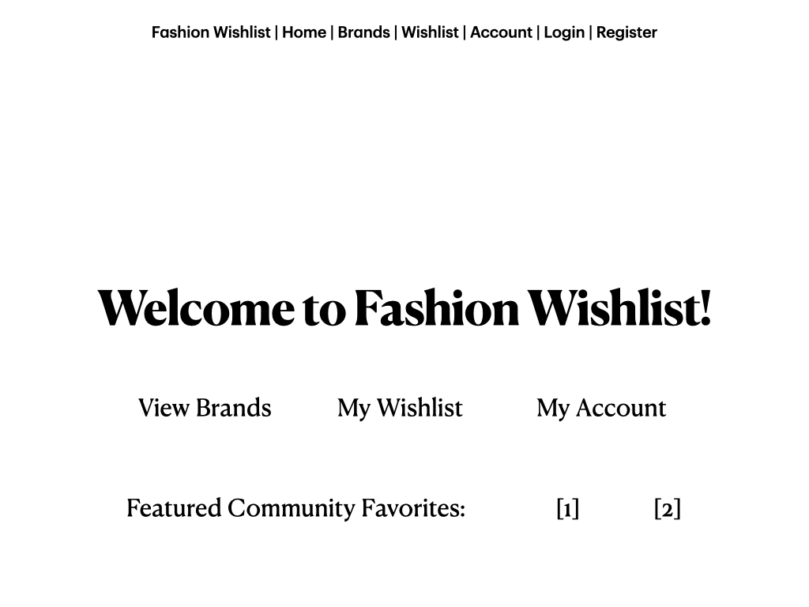
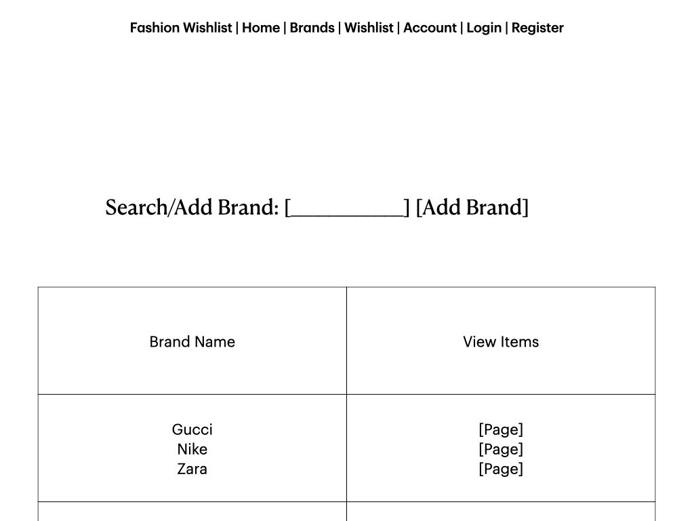
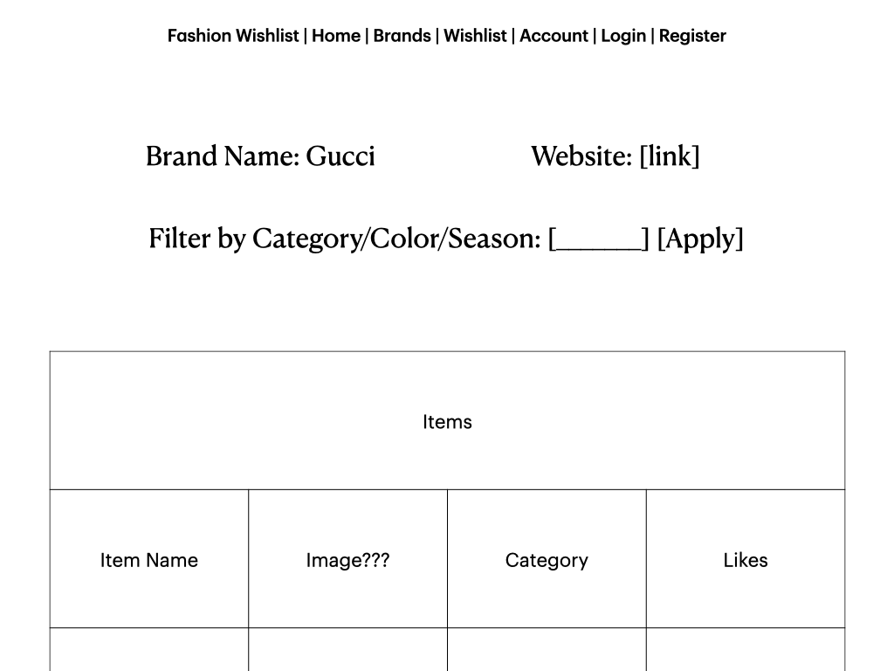
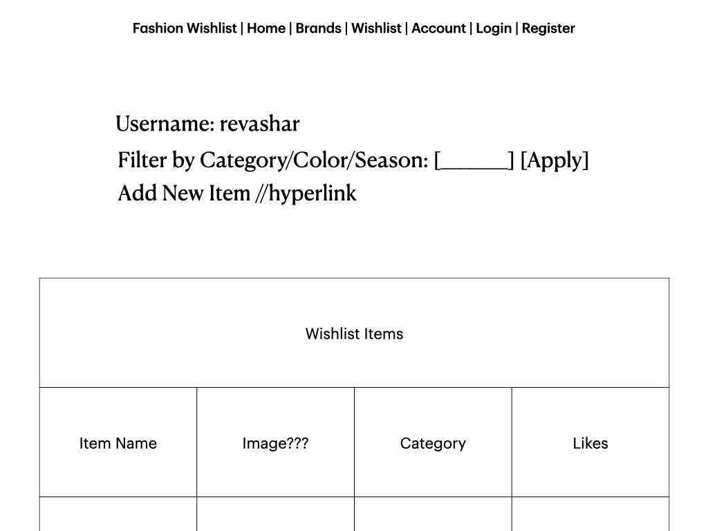
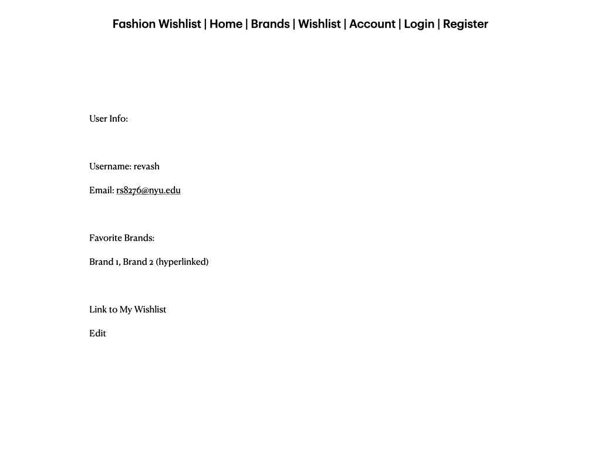
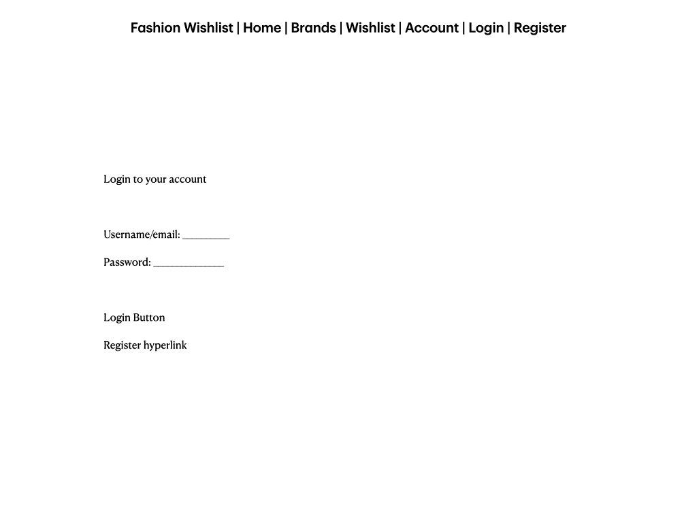
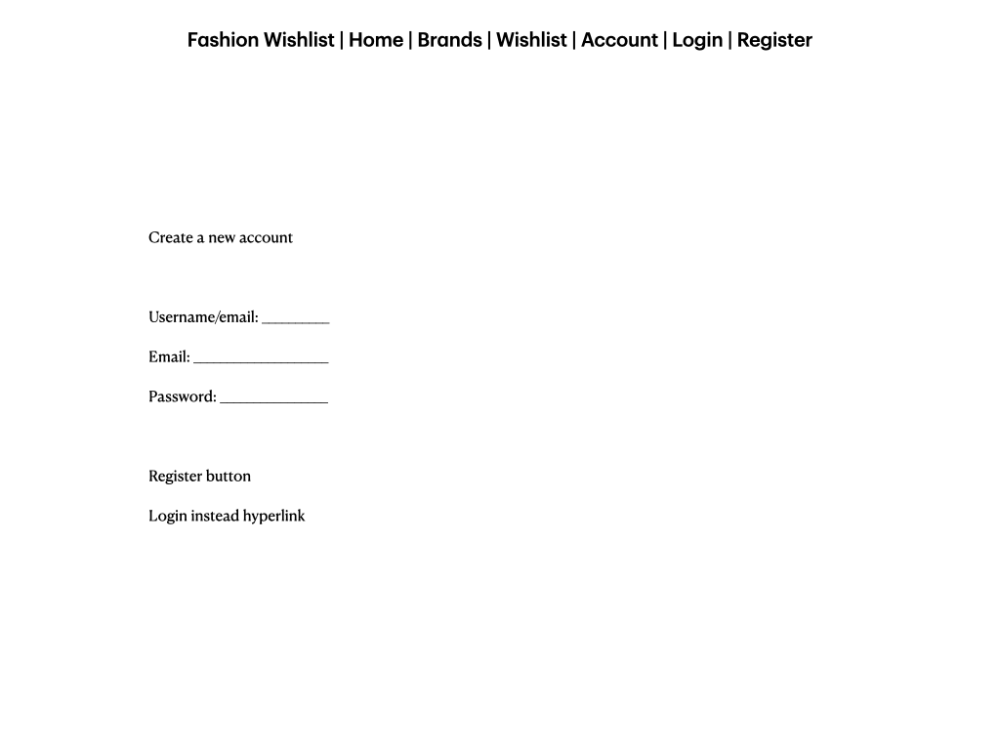
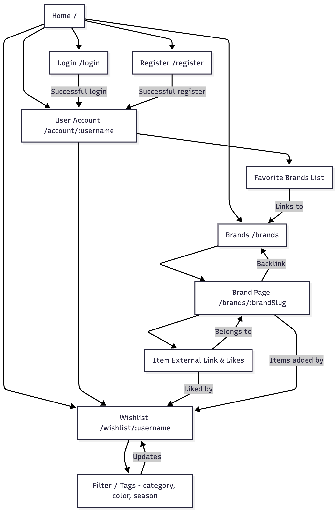

# Fashion Wishlist

## Overview

Fashion Wishlist is a web application that allows users to curate their dream wardrobe by saving clothing items from their favorite fashion brands. Users can create accounts, select their favorite brands, and build a wishlist of clothing items by entering product details — such as the item name, category, color, size, and a direct link to the brand’s website.

Each brand has its own dedicated page showing all wishlist items users have added from that brand. Users can explore these community wishlists, “heart” their favorite items, and use filters by color, category, or season to find inspiration or track trends. The app helps fashion enthusiasts keep their favorite styles organized while discovering new pieces from others’ wishlists.

## Data Model

The application will store Users, Brands, and Wishlist Items.

* Users can have multiple favorite Brands (via references).

* Users can have multiple Wishlist Items (via references).

* Each Brand can be linked to multiple Wishlist Items added by different users.

* Each Wishlist Item stores its details directly, including name, category, color, size, link, and optional tags (by embedding these fields).

* Wishlist Items can also store a count of community hearts, representing how many users have favorited that item.

* Tags (color, category, season) allow filtering of items when viewing a brand page or personal wishlist.


An Example User:

```javascript
{
  _id: ObjectId("..."),
  username: "username",
  email: "user@example.com",
  passwordHash: "hashedpassword123",
  favoriteBrands: [ ObjectId("..."), ObjectId("...") ],
  createdAt: //timestamp
}
```

An Example Brand:

```javascript
{
  _id: ObjectId("..."),
  name: "Aritzia",
  website: "https://www.aritzia.com",
  description: "Canadian fashion retailer known for minimalist designs.",
  createdAt: //timestamp
}
```

An Example Wishlist Item:

```javascript
{
  _id: ObjectId("..."),
  userId: ObjectId("..."),
  brandId: ObjectId("..."),
  name: "Effortless Pants",
  category: "Bottoms",
  color: "Black",
  size: "S",
  link: "https://www.aritzia.com/en/product/effortless-pant/98321.html",
  season: ["Spring", "Summer"],
  likes: 24,
  createdAt: //timestamp
}
```


## [Link to Commented First Draft Schema](db.mjs) 

## Wireframes

(__TODO__: wireframes for all of the pages on your site; they can be as simple as photos of drawings or you can use a tool like Balsamiq, Omnigraffle, etc.)

/list/create - home



/list - brands



/list/slug - one brand's page



/list - wishlist



/list - user acc page



/list - login



/list - register



## Site map



## User Stories or Use Cases

* As a new user, I want to sign up so I can save and access my fashion wishlist.
* As a user, I want to select and manage my favorite brands.
* As a user, I want to add wishlist items with details like color, size, and product link.
* As a user, I want to “heart” items I love to mark them as favorites.
* As a user, I want to view a brand’s page to discover wishlist items others have added from that brand.
* As a user, I want to filter items by color, category, or season to find inspiration.
* As a user, I want to click on an item link to view it on the brand’s official site.

## Research Topics

* (5 points) Front-End Framework — React or Next.js
  * Using React (or Next.js) as the frontend framework to create a dynamic, responsive UI for the fashion wishlist.
  * This will enable users to view images for wishlist items and brand logos, as well as like items and filter by category, color, or season without page reloads.
  * Allows integration of reusable components for brands, items, and user wishlists.
  * The setup will require connecting the frontend to the Express backend through REST API routes or integrated Next.js API routes.

* (2 points) CSS Framework — TailwindCSS
  * TailwindCSS will be used for clean, responsive styling.
  * This makes it easier to customize color palettes, spacing, and themes for different fashion brands and items.
  * Tailwind will be configured via PostCSS or directly integrated with React/Next.

* (2 points) Unit Testing — Jest
  * Will implement unit tests for Mongoose schemas and Express routes using Jest.
  * For example: testing user creation, adding wishlist items, linking brands, and updating likes/hearts.

* (1 point) Code Quality — ESLint Integration
  * ESLint will be configured to automatically check and enforce consistent code style on save.
  * A .eslintrc configuration file will be included in the repository.
  * Ensures maintainable and readable code throughout both backend and frontend components.

10 points total out of 10 required points

## [Link to Initial Main Project File](app.mjs) 

## Annotations / References Used

Currently code based off hw assignments and class notes
